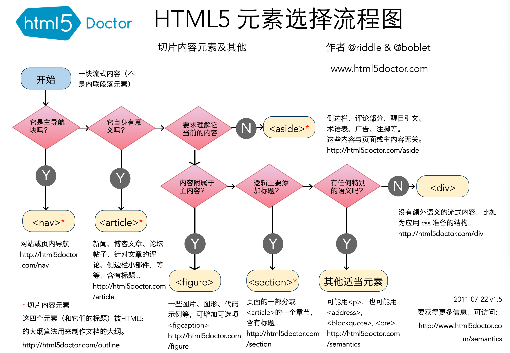

# HTML 理论知识点

## HTML 语义化

HTML 语义化（Semantic HTML）是指使用具有语义意义的标签来构建网页结构，而不是仅仅使用通用的、没有特定含义的标签。语义化标签能够更清晰地表达页面的结构和内容，使浏览器、开发者、搜索引擎、屏幕阅读器等更容易理解网页的内容和层次结构。

::: tip 语义化的优点

- 提高可读性：语义化标签让代码更直观，提升代码的可维护性。
- 提升无障碍体验：语义化标签让屏幕阅读器等辅助技术能更准确地解释页面的内容
- 对 `SEO` 友好：搜索引擎通过语义化的结构可以更好地抓取和理解网页内容
- 跨浏览器兼容性：语义化的 `HTML` 可以确保在不同的浏览器中有更一致的行为和展示效果。
  :::

### 常用的语义化标签

- **`<header>`**：定义页面或区块的头部，通常包含导航、标题等信息。
- **`<nav>`**：定义导航链接的部分。
  - 在 **`header`** 中大多表示文章目录
  - 在 **`aside`** 中大多是关联页面或者是整站地图
- **`<main>`**：定义文档的主要内容，页面中只能有一个 `<main>` 元素。
- **`<article>`**：定义一个独立的内容块，适用于文章、博客、新闻等内容。
- **`<h1> ~ <h6>`**：表示文章中不同层级的标题
- **`p`**: 表示文章的段落
- **`<section>`**：定义页面中的一个区块或章节，用于将内容分组。
- **`<aside>`**：定义侧边栏内容，与主内容有关联的辅助信息。
- **`<footer>`**：定义页面或区块的底部，通常包含版权声明、联系信息等。
- **`<figure>`** 和 **`<figcaption>`**：用于标记图片、图表等多媒体内容，`<figcaption>` 提供对该内容的描述。
- **`<mark>`**：标记文本的重要性或高亮部分。
- **`<time>`**：表示时间或日期，适合于新闻发布、事件发生等时间信息。

**`HTML5` 标签选择流程图**

> 参考：
>
> - [其他标签详情](https://developer.mozilla.org/zh-CN/docs/Web/HTML/Element)
> - [HTML5 标签学习](https://html5doctor.com/)

## HTML 的元素嵌套规则

HTML 元素嵌套规则是指 HTML 标签在嵌套时的合法性，即**标签嵌套的顺序和层级**

- 块级元素（Block-level elements）：通常独占一行，并且可以包含其他块级元素或行内元素。例如：**`
`**,**` 
`**, **`<h1>`** 等。

- 行内元素（Inline elements）：通常不会独占一行，只占用其内容的宽度，通常只能包含文本或其他行内元素。例如：**``**, **`<a>`**, **`<strong>`** 等。

:::tip 常见的 HTML 元素嵌套规则

- 块级元素可以包含其他块级元素或行内元素
- 行内元素不能包含块级元素
- **`
`** 标签：段落标签只能包含行内元素，不能直接包含块级元素。
- **`<ul>`** 和 **`<ol>`** 标签：**`<ul>`**和 **`<ol>`** 只能包含 **`<li>`** 元素，不能直接包含其他块级或行内元素。
- **`<a>`** 标签：**`<a>`**（超链接）标签可以包含其他行内元素，但是不能包含交互式元素（如 **`<button>`** 或 **`<input>`**）。
  :::

## HTML5 的新特性

HTML5 引入了许多新特性和改进，旨在提升网页的结构化、语义化、功能性和多媒体支持。以下是一些主要的 HTML5 新特性：

- **SVG 支持**：原生支持 SVG（可缩放矢量图形），可以直接在 HTML 中嵌入和绘制矢量图。
- **本地存储**：引入了本地存储机制如：`localStorage`：持久化存储，数据除非手动清除，否则一直存在，`sessionStorage`：会话级存储，页面关闭后数据消失。
- **语义化标签**：提供了新的语义化标签，如 **`<header>`**、**`<nav>`**、**`<main>`**、**`<article>`** 等使得网页结构更加清晰，方便开发者、搜索引擎以及屏幕阅读器理解页面内容。
- **多媒体元素**：内置了对多媒体的支持，新增 **`<audio>`** 、**`<video>`** 媒体标签
- **表单增强功能**：新增表单控件（`type=""`）如：**`date`**、 **`email`**、 **`url`**、 **`color`**等，以及表单属性 **`required`**、 **`placeholder`** 、**`autocomplete`** 等
- **Canvas 画布**： 提供了 **`<canvas>`** 元素，允许通过 `JavaScript` 绘制图形、图表和动画
- **地理定位 API**：提供了 `Geolocation` API，允许网页获取用户的地理位置（需用户授权）。
- **Web Workers**：`Web Workers` 允许网页在后台运行 `JavaScript`，分离主线程和后台线程，避免长时间操作导致页面阻塞，从而提升网页性能。
- **WebSocket**：提供了在浏览器和服务器之间进行双向通信的能力，适用于实时聊天、股票行情等需要实时数据交互的场景。
- **历史状态管理（History API）**：通过 `History API`，开发者可以管理浏览器历史记录，增强单页应用的体验。

:::tip HTML5 与 H5

> HTML5 和 H5 这两个术语虽然表面上看似相似，但它们有着不同的含义，主要在技术背景和应用场景上有所区别

- HTML5 是 HTML（超文本标记语言） 的第五个版本，代表了网页设计与开发的最新标准。HTML5 专注于为网页提供更好的语义结构和更丰富的多媒体功能，减少对插件（如 Flash）的依赖。
- H5 是 HTML5 的简写，但在中文互联网环境中，它逐渐演变为一种特定的概念，通常指基于 HTML5 技术 开发的 移动端网页应用 或 轻应用。在国内，H5 页面 这一术语通常与 移动端 场景强相关，尤其是通过 微信 等社交媒体平台打开的互动页面。

  - H5 营销活动页面：品牌推广、节日促销时经常通过微信分享的互动页面
  - H5 游戏：简单的网页游戏，用户可以通过手机直接进行互动和娱乐，无需下载 App。

:::
