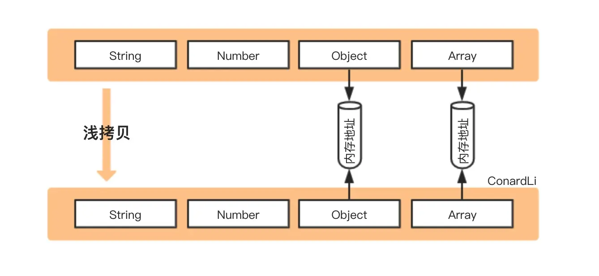

# 引用类型的拷贝

::: tip 回顾一下引用类型的特点

- 因为 `JavaScript` 不允许直接访问内存位置（即不能直接操作引用类型所在的内存空间），所以引用类型在 **栈内存** 中存储的是地址（即内存指针），而引用类型中的数据（方法或属性）是存储在 **堆内存** 中
- 保存引用类型的变量是 **按引用 (by reference) 访问** ，当我们访问和操作一个对象时，实际上操作的是对该对象的引用而非实际的对象本身
- 复制引用类型时只会复制内存指针

:::

因此我们在开发过程中对引用类型进行拷贝并修改时，便需要根据场景需求注意对原本数据的影响。

## 浅拷贝



> 图片来源于[如何写出一个惊艳面试官的深拷贝?](https://juejin.cn/post/6844903929705136141)

浅拷贝是创建一个新对象，这个对象有着原始对象属性值的一份精确拷贝：基本类型拷贝的是值，引用类型拷贝的就是内存地址；所以当我们**操作新对象中的引用类型时会影响源对象**

### Object.assign()

```js
const obj1 = {
  name: "heizi",
  props: { a: 1 },
};

const obj2 = Object.assign({}, obj1);
obj2.name = "黑子";
obj2.props.a++;

//可以看出基本类型拷贝的是值，但引用类型拷贝的就是内存地址
obj1; // { name: 'heizi', props: { a: 3 } }
obj2; // { name: '黑子', props: { a: 3 } }
```

### `Array.prototype.concat()`

```js
const arr1 = [1, 2, 3, [4, 5]];

const arr2 = arr1.concat();
arr2[0] = "arr2";
arr2[3][0] = "arr2";

arr1; // [1, 2, 3, ['arr2', 5]];
arr2; // ['arr2', 2, 3, ['arr2', 5]];
```

### `Array.prototype.slice()`

```js
const arr1 = [1, 2, 3, [4, 5]];

const arr2 = arr1.slice();
arr2[0] = "arr2";
arr2[3][0] = "arr2";

arr1; // [1, 2, 3, ['arr2', 5]];
arr2; // ['arr2', 2, 3, ['arr2', 5]];
```

### `ES6` 扩展运算符

```js
/* 对象 */
const obj1 = {
  name: "heizi",
  props: { a: 1 },
};

const obj2 = { ...obj1 };
obj2.name = "黑子";
obj2.props.a++;

obj1; // { name: 'heizi', props: { a: 2 } }
obj2; // { name: '黑子', props: { a: 2 } }

/* 数组 */
const arr1 = [1, 2, 3, [4, 5]];

const arr2 = [...arr1];
arr2[0] = "arr2";
arr2[3][0] = "arr2";

arr1; // [1, 2, 3, ['arr2', 5]];
arr2; // ['arr2', 2, 3, ['arr2', 5]];
```

## 深拷贝


深拷贝是将一个对象从内存中完整的拷贝一份出来，即从堆内存中开辟一个新的区域存放新对象，所以**修改新对象不会影响原对象**

### `JSON.parse(JSON.stringify())`

```js
const obj1 = {
  name: "heizi",
  props: { a: 1 },
};

const obj2 = JSON.parse(JSON.stringify(obj1));
obj2.name = "黑子";
obj2.props.a++;

obj1; // { name: 'heizi', props: { a: 1 } }
obj2; // { name: '黑子', props: { a: 2 } }
```

**`JSON.parse(JSON.stringify())` 存在明显的弊端：**

- 只能序列化对象的可枚举的自有属性
- `undefined`、`Symbol`、任意函数将被忽略
- `NaN`、`Infinity` 、`-Infinity` 将被当成 `null` 处理
- `RegExp`、`Error`、`Set`、`Map` 等特殊对象，仅会序列化可枚举的属性（一般情况下即为空对象）
- `Date` 类型，转换后会调用 `toJSON` 转为字符串类型
- 循环引用的对象将报错

```js
const map = new Map();
map.set(1, 2); // Map: 0: {1 => 2}
const obj1 = {
  a: undefined,
  b: null,
  c: Symbol(),
  d: NaN,
  e: Infinity,
  f: -Infinity,
  g: map,
  h: new Date(),
  i: () => {},
};
Object.defineProperty(obj1, "j", {
  value: "string",
});

const obj2 = JSON.parse(JSON.stringify(obj1));

/** 源对象 obj1
{
  a: undefined,
  b: null,
  c: Symbol(),
  d: NaN,
  e: Infinity,
  f: -Infinity,
  g: Map(1) {1 => 2}
  h: Fri Mar 10 2023 22:41:08 GMT+0800 (中国标准时间) {},
  i: () => {},

  j: 'string'
}
**/

/** 新对象 obj2
{
  b: null,
  d: null,
  e: null,
  f: null,
  g: {},
  h: '2023-03-10T14:41:08.110Z'
}
**/
```

### `structuredClone`

> `HTML` 规范标准的 [Web API](https://developer.mozilla.org/zh-CN/docs/Web/API/structuredClone)

```js
const original = { name: "MDN" };
original.itself = original;

const clone = structuredClone(original);

console.assert(clone !== original); // the objects are not the same (not same identity)
console.assert(clone.name === "MDN"); // they do have the same values
console.assert(clone.itself === clone); // and the circular reference is preserved
```

`HTML` 规范的标准提案，使用结构化克隆算法将给定的值进行深拷贝，支持循环引用。还可以使用 `structuredClone(value, { transfer })` 调用方式使可转移对象仅被传递，不被克隆（直接移动源数据）

:::warning 注意点

尽管作为规范标准实现的 `Web API`，但目前兼容性还是个巨大的问题，同时仍有其他不足：

- 无法拷贝对象的原型链
- 无法拷贝函数
- 不支持 `Error` 数据类型

:::

### `MessageChannel`

> `vue.nextTick` 源码曾使用的 `Web API`，在了解这个 `API` 时发现可以用于深拷贝

```js
function cloneUsingChannel(obj) {
  return new Promise((resolve) => {
    const channel = new MessageChannel();
    channel.port1.onmessage = (e) => resolve(e.data);
    channel.port2.postMessage(obj);
  });
}
```

但该方法存在一个缺陷，当拷贝对象带有函数属性时，将抛出错误：

```js
const obj1 = {
  fn: function () {},
};
const obj2 = cloneUsingChannel(obj1);
// Uncaught (in promise) DOMException: Failed to execute 'postMessage' on 'MessagePort': function () {} could not be cloned.
```

### `JQuery.extend()`

```js
import $ from "jquery";

const obj2 = $.extend(true, {}, obj1);
```

### `lodash.cloneDeep`

```js
import { cloneDeep } from "lodash-es";

const obj2 = cloneDeep(obj1);
```
