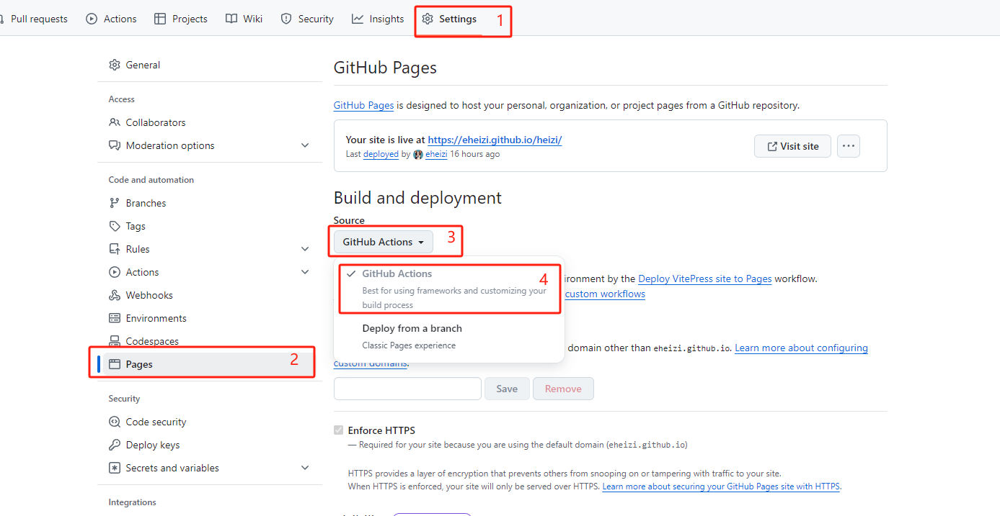

# 这是一篇记录博客诞生的笔记

## **为何要建立博客？**

> **“别人的屋檐再大，都不如自己有把伞。”** —— 摘自《莫言语录》
>
> - 分享自己的见解和经验，帮助他人。
> - 系统记录学习的技能，整理和巩固知识。
> - 记录学习过程和成长历程，便于回顾与反思。
> - 记录自己遇到的实用工具和库，以便于日后参考和使用。

## 项目搭建

> 参考了很多大佬的博客，最终选择使用`VitePress`搭建(快速，使用`vue`、`vite`，最主要的是好看！！！)

<!-- 博客内容很大部分参考了 [茂茂物语](https://notes.fe-mm.com/) -->

## 使用 GitHub pages 部署网址

- 登录 GitHub 并创建库（`GitHub pages` 想要免费使用只能为 `public` ）
- 将本地博客`push`到 github 中
- 开启`GitHub pages` 选择`GitHub Actions`
  
- 项目新建 `.github/workflows/deply.yml`配置 `deploy.yml` 文件(我这里使用的是[`VitePress`推荐的模板](https://vitepress.dev/zh/guide/deploy#github-pages))

```yml
# 构建 VitePress 站点并将其部署到 GitHub Pages 的示例工作流程
#
name: Deploy VitePress site to Pages

on:
  # 在针对 `main` 分支的推送上运行。如果你
  # 使用 `master` 分支作为默认分支，请将其更改为 `master`
  push:
    branches: [main]

  # 允许你从 Actions 选项卡手动运行此工作流程
  workflow_dispatch:

# 设置 GITHUB_TOKEN 的权限，以允许部署到 GitHub Pages
permissions:
  contents: read
  pages: write
  id-token: write

# 只允许同时进行一次部署，跳过正在运行和最新队列之间的运行队列
# 但是，不要取消正在进行的运行，因为我们希望允许这些生产部署完成
concurrency:
  group: pages
  cancel-in-progress: false

jobs:
  # 构建工作
  build:
    runs-on: ubuntu-latest
    steps:
      - name: Checkout
        uses: actions/checkout@v4
        with:
          fetch-depth: 0 # 如果未启用 lastUpdated，则不需要
      - uses: pnpm/action-setup@v3 # 如果使用 pnpm，请取消此区域注释
        with:
          version: 9
      # - uses: oven-sh/setup-bun@v1 # 如果使用 Bun，请取消注释
      - name: Setup Node
        uses: actions/setup-node@v4
        with:
          node-version: 20
          cache: pnpm # 或 pnpm / yarn
      - name: Setup Pages
        uses: actions/configure-pages@v4
      - name: Install dependencies
        run: pnpm install # 或 pnpm install / yarn install / bun install
      - name: Build with VitePress
        run: npm run docs:build # 或 pnpm docs:build / yarn docs:build / bun run docs:build
      - name: Upload artifact
        uses: actions/upload-pages-artifact@v3
        with:
          path: dist

  # 部署工作
  deploy:
    environment:
      name: github-pages
      url: ${{ steps.deployment.outputs.page_url }}
    needs: build
    runs-on: ubuntu-latest
    name: Deploy
    steps:
      - name: Deploy to GitHub Pages
        id: deployment
        uses: actions/deploy-pages@v4
```

- 进入 `Actions` 查看是否部署成功

## 踩到的坑

1、 部署成功后但样式并未显示

[官方解释](https://vitepress.dev/zh/reference/site-config#base)

```js
    //库名称为什么base就是什么，它会读取/开头的路径自动添加base
  base: "/heizi/",
```

2、 配置`GitHub pages`时，选择`GitHub Actions`，会自动生成`deploy.yml`文件，但是这个文件是空的，需要手动配置，参考[官方文档](https://vitepress.dev/zh/guide/deploy#github-pages)

3、打包问题

1. 项目中空指向的链接也会报错如：`[内容](链接为空)`
2. `Windows` 默认不识别文件大小写，本地打包不出错，`GitHub`上打包可能就会出错最好在项目中设置：`git config core.ignoreCase false`

```js
//>>> config.ts
{
    ignoreDeadLinks: [
    "./about/", // 忽略精确的 URL
    /^https?:\/\/localhost/, // 忽略所有 localhost 链接
    /\/repl\//, // 忽略所有包含 "/repl/" 的链接
    (url) => {
      return url.toLowerCase().includes("ignore"); // 自定义函数，忽略所有包含 "ignore" 的链接
    },
  ],
}
```

:::tip 参考：

- [vitePress](https://vitepress.dev/zh/)
- [茂茂物语](https://notes.fe-mm.com/)

:::
